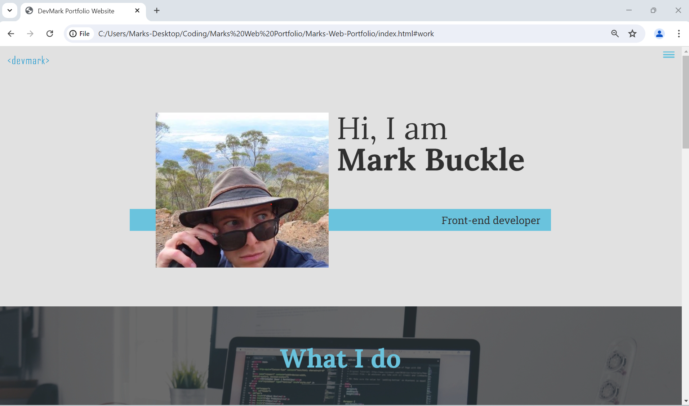
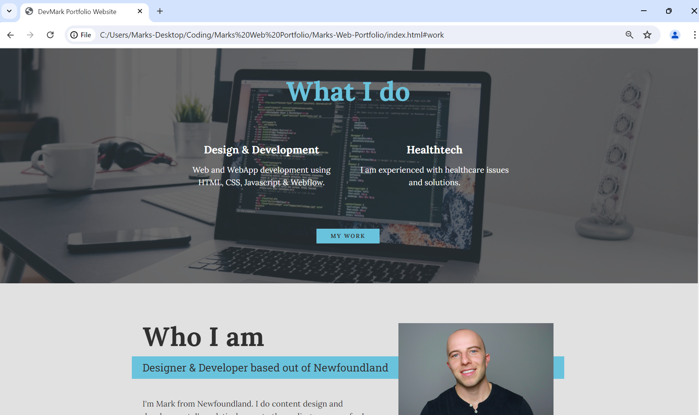
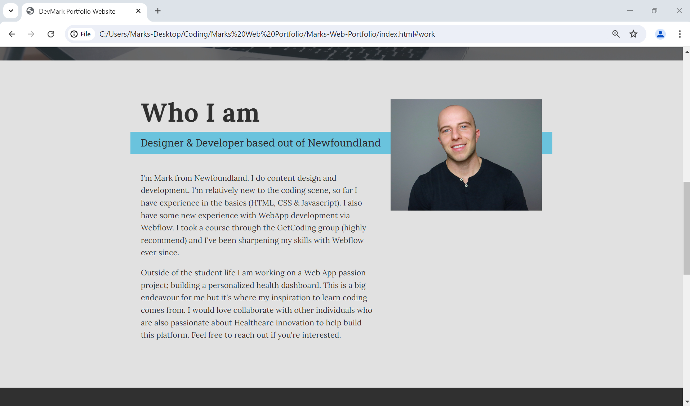
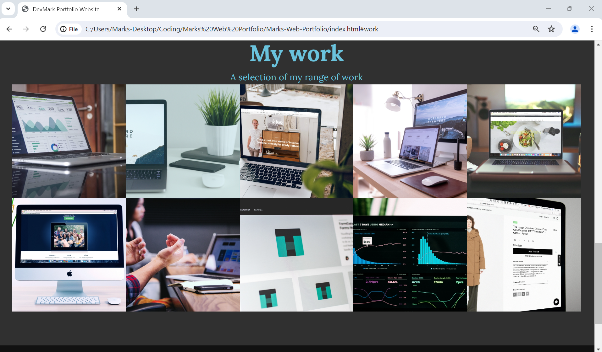
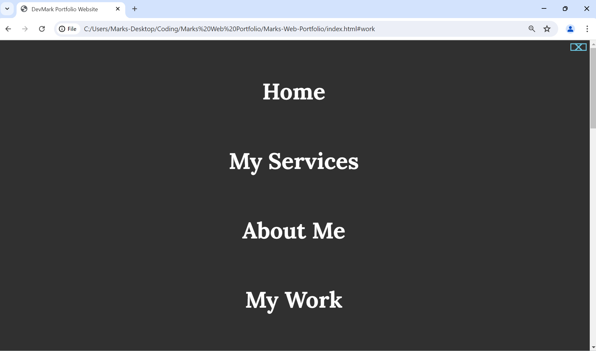

# Marks-Web-Portfolio

This portfolio was built using just html, css and javascript

Icons were imported using http://www.w3.org/2000/svg

Fonts were imported using FontAwesome

This portfolio is not hosted as I have a new one. Preview below:

